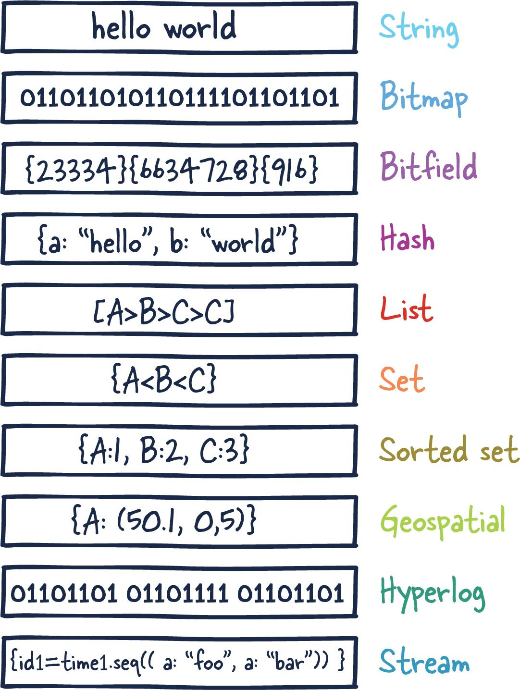

# Redis

REmote DIctionary Server. Open-source key-value database server

#### links

[article](https://architecturenotes.co/p/redis)

## Architecture

Typically used as a cache in front of another "real" database to improve application performance

### Single Redis Instance

Basic setup

### Redis HA

One or several replicas that is synced with "master"

### Redis Sentinel

tbd

### Redis Cluster

tbd

## Data Types

## Features

* In-Memory DB - data stored in RAM
* Could be used as Cache ontop of other DB
* Multi-Model DB

### Whats inside

Redis Core - key-value store. Could store multiple types of data. Strings. sets, hashes, lists, etc.

### Redis Modules

* RediSearch
* SerisGraph
* RedisTImeSeries
* RedisJSON

### Ways to safe Redis data

* Snapshots (RDB) (take time, may lose newest data)
* Append Only File (AOF) - logfile updated on every change
