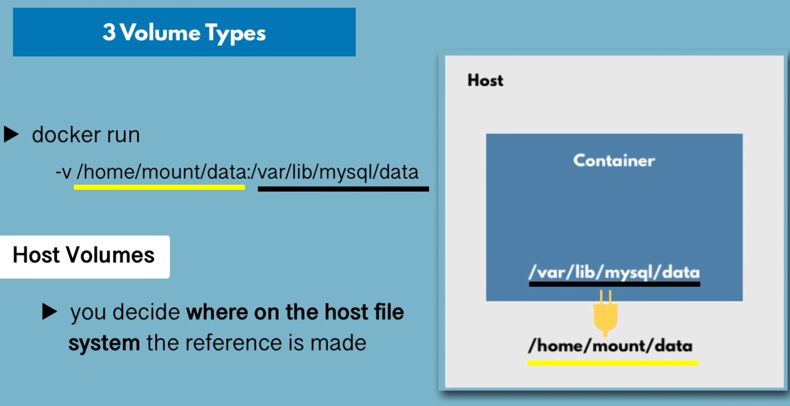
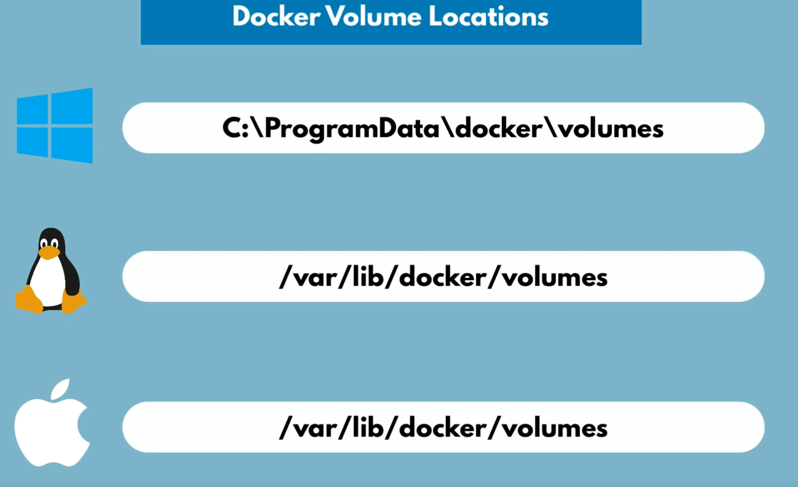

# 🗄 Docker Volumes

Volumes are the preferred mechanism for persisting data generated by and used by Docker containers.


### Example

#### named volulme

```bash
# create vol
docker volume create mydata

# create container with volume and modify data in shated folder
docker run -d --name container1 -v mydata:/data busybox sleep 3600
docker exec -it container1 sh
echo "Data from container 1" > /data/shared.txt

# get shared data from another container
docker run -d --name container2 -v mydata:/data busybox sleep 3600
docker exec -it container2 sh
cat /data/shared.txt
```

#### Mysql

We need to find the dir where stores important data and mount it to folder outside container.\
for mysql default folder is `/var/lib/mysql`

All data replicated. Container will use data from host when starts. Container will save updated data to host.

## Volume types

### Host-mounted Volumes

Allows access to data that is stored on the host machine from within the container, useful for providing persistent storage or to share files between the host and the container.

```bash
docker run -v /home/dir/dir/data:/var/lib/mysql
```



### Anonymous Volumes

Automatically created by Docker when a container is created. Do not have a user-defined name, typically used for storing temporary data that does not need to be shared between containers.

```bash
docker run -v /var/lib/mysql
```


### Named Volumes

Created by the user, often used when data needs to be shared between containers

```bash
docker run -v mysql-storage:/var/lib/mysql
```


## Access options

| Name       | Description                                                                                                                                                                                                                                                                                                                                                                                     |
| ---------- | ----------------------------------------------------------------------------------------------------------------------------------------------------------------------------------------------------------------------------------------------------------------------------------------------------------------------------------------------------------------------------------------------- |
| Read-Only  | `ro` option. This prevents data from being modified by the container.                                                                                                                                                                                                                                                                                                                           |
| Read-Write | `rw` option, allowing data from the volume to be both modified and read by the container.                                                                                                                                                                                                                                                                                                       |
| SELinux    | `z` option. - ensures that the container has exclusive read-write access to the volume and prevents other containers or processes from accessing or modifying it.<br>is specific to systems with SELinux enabled, which includes certain Linux distributions like CentOS or Fedora.                                                                                                             |
| `Private`  | `private` option. allows to mount a volume with private visibility.<br>- It makes the volume accessible only to the container in which it is defined.<br>- Other containers running on the same host won't have access to this volume.                                                                                                                                                          |
| `Nocopy`   | `nocopy` option.prevents Docker from copying the volume data from the host into the container when it starts.<br>- Instead, the container starts with an empty directory at the mount point, and any changes made to the volume are persisted only on the host.<br>- This option can be useful when you want to create a container that shares an existing volume without duplicating its data. |
| `Shared`   | `shared` option allows multiple containers to share the same volume.<br>- By default, volumes are shared. So it is not always necessary to specify this option.                                                                                                                                                                                                                                 |

## In Compose

```yaml
mongodb:
    image: mysql
    volumes:
      - mysql-storage:/var/lib/mysql
volumes:
    mysql-storage:
        driver: local
```

## Volume Location



! on mac data stores on linux VM machine

```bash
# it could be smthg like
screen ~/Library/Containers/com.docker.docker/Data/com.docker.driver.amd64-1inux/tty
# and there is linux filesystem will be /var/lib/docker/volumes
```
