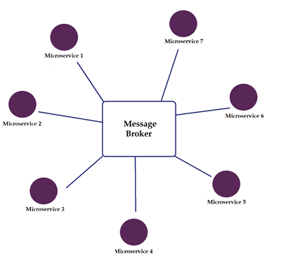
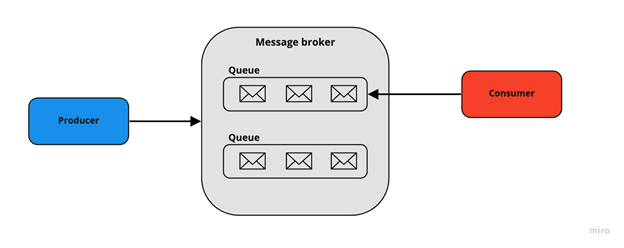
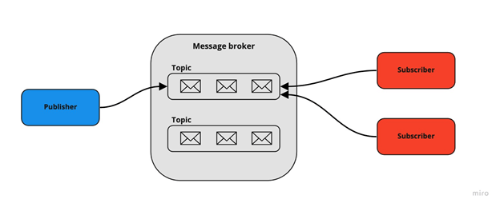

# 🐇 Message Brokers

#### links

- [link](https://hasithas.medium.com/introduction-to-message-brokers-c4177d2a9fe3)

## basics

Message broker is a middleware that facilitates communication between different applications, services, or components by receiving, storing, and forwarding messages. 

### Components of a message broker

#### Producer/Publisher

Integration with existing service that creates "events". Sends messages to the broker.

#### Consumer/Subscriber

Service that receives messages from the broker and process it. 

#### Queue/Topic

Queue: A storage area where messages are placed for consumers to pick up (used in Point-to-Point or Queue model).

Topic: A named logical channel to which messages are sent, allowing multiple consumers to receive the same message (used in Publish/Subscribe model).

#### Broker

Manages message delivery between producers and consumers.

### Process Description

- Producer Sends a Message
	•	The producer sends a message to the broker. The message could be anything like task data, event notifications, or user interactions.
- Broker Receives the Message:
	•	The broker stores the message temporarily, either in a queue (point-to-point) or a topic (publish/subscribe).
	•	The broker can also apply routing rules to determine where the message goes.
- Consumer Picks Up the Message:
	•	The consumer retrieves the message from the queue (in the case of a queue-based system) or from the topic (in the case of a pub/sub system).
	•	In some cases, multiple consumers can receive the same message (in pub/sub systems).
	•	The broker ensures that each message is delivered to the appropriate consumer(s).
- Acknowledgment and Processing:
	•	After processing, the consumer acknowledges receipt of the message to the broker, which then removes the message from the queue or topic.

## messaging patterns
### Point-to-Point (Queue Model)

* message queues have a one-to-one relationship with the message’s sender (Producer) and receiver (Consumer).
* Each message in the queue is only sent to one recipient and is received only once.
* Optimal for financial transaction processing since payment needs to be done only once

### Publish-Subscribe 

* In this model, message queues have a one-to-many relationship with the message sender and receiver. Also, the sender is known as the publisher and the receiver is known as the subscribe.
* According to this model, a sender publishes messages on a topic. These messages are distributed among all the consumers that have subscribed to the topic.
* This model can be used for a system where data should be shared among several parties constantly.
