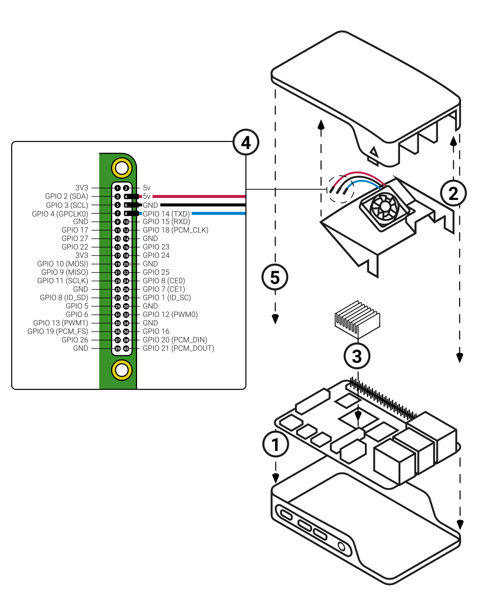

# 🍇 Raspberry Pi

links
- https://www.raspberrypi.com/documentation

## Commands

### Linux

Moved to [linux](../../apps-and-tools/cli/linux.md)

### Pi

```bash
# manage settings
sudo raspi-config

# memory allocation
vcgencmd get_mem 

# temperature check
vcgencmd measure_temp

vcgencmd measure_volts
vcgencmd get_mem gpu

# watcher
watch -n 1 vcgencmd measure_temp

# get hardware info
cat /proc/cpuinfo
```

## Connect

app - https://connect.raspberrypi.com
doc - https://www.raspberrypi.com/documentation/services/connect.html

```bash
sudo apt update # fetch updates

# install connect
sudo apt install rpi-connect

sudo reboot

# get url to connect
rpi-connect signin

# off screen sharing
rpi-connect vnc off

# manual start
systemctl --user start rpi-connect

# manual reload
systemctl --user daemon-reload

# status
systemctl --user status rpi-connect
rpi-connect status
```

## Soft

Moved to [linux](../../apps-and-tools/cli/linux.md)

## hard

### Original Fan for pi 4 model

Can be managed via `raspi-config`. 


