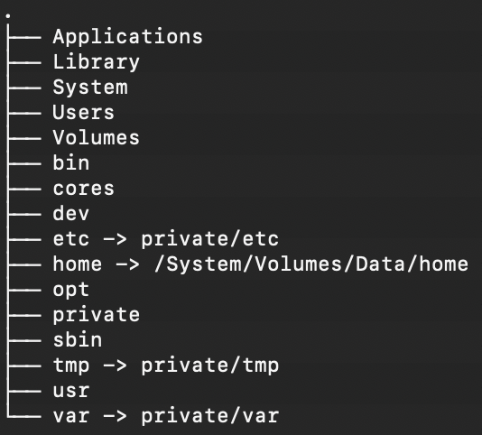

# 💻 comfy macOS

## MacOS Filesystem

### root



* **Applications**: Contains all the applications installed on Mac
* **Library**: Stores fonts and other items used by applications
* **System**: macOS operating system
* **Users**: home folders of all users
* **Home**: holds your personal files and folders
* **Developer**: Appears only if Apple’s Developer Tools are installed, containing tools, documentation, and files for development
* **Network**: Contains network-related devices, servers, libraries, etc
* **Volumes**: Includes mounted devices and volumes, such as hard disks, CDs, DVDs, DMG mounts, etc
* **/bin**: Holds essential common binaries necessary for booting the operating system and its proper functioning
* **/etc**: Contains local system configuration files, including administrative and system files
* **/dev**: Includes device files representing peripheral devices like keyboards, mice, and trackpads
* **/usr**: containing subdirectories with information, configuration files, and other essentials used by the operating system
* **/sbin**: Contains essential system binaries and utilities for system, similar to Bin (/bin)
* **/tmp**: A directory for temporary files and caches
* **/var**: Holds variable data, which includes files whose contents change as the operating system runs

### folders

The `/var/folders` directory on macOS contains temporary files and caches used by the system and applications.

System Temporary Files

- Process-specific temporary data
- System caches
- Application caches
- User-specific temporary files

Directory Structure

```bash
/var/folders/
    zz/         # Random two-character directory names
        xxxxxx/ # Long alphanumeric strings
            T/  # Temporary items
            C/  # Caches
```

#### System/User Application folders and tools

```bash
# Privileged Tools & Services
ls -la /Library/PrivilegedHelperTools # tools requiring elevated privileges (e.g., auto-updaters, system services)

ls -la /Library/LaunchAgents # run on user login for all users
ls -la ~/Library/LaunchAgents # for current user

ls -la /Library/LaunchDaemons/ # run as root, no user login required

# Application Support
ls -la /Library/Application\ Support
ls -la ~/Library/Application\ Support

# app preferences
ls -la /Library/Preferences/
ls -la ~/Library/Preferences/

# soft and tools
ls -la /usr/local/bin/ # user CLI tools
ls -la /opt/ # soft (homebrew)

# applications
ls -la /Applications/
ls -la ~/Applications/
```

## Custom 'defaults' settings

macOS applications and other programs use the **defaults** system to record user preferences and other information to be maintained when the application isn't running.

User defaults belong to **domains**, which typically correspond to individual applications. Each domain has a dictionary of keys and values representing its defaults; for example, `"Default Font" = "Helvetica"`. 

Keys are strings, Values can be complex data structures comprising arrays, dictionaries, strings, and binary data. Stored as XML Property Lists.

#### links

 - [examples](https://macos-defaults.com/)
 - [docs](https://www.real-world-systems.com/docs/defaults.1.html)

### Fast dock

- https://macos-defaults.com/dock/autohide-delay.html

```bash
# make fast
defaults write com.apple.dock "autohide-delay" -float "0" && killall Dock
# bring back
defaults delete com.apple.dock "autohide-delay" && killall Dock
```

### Active applications only

```sh
# enable
defaults write com.apple.dock "static-only" -bool "true" && killall Dock

# reset
defaults delete com.apple.dock "static-only" && killall Dock
```

### Change screenshot format

```shell
defaults write com.apple.screencapture type JPG && killall SystemUIServer
```

## other

spotlight indexing

```shell
# disable
sudo mdutil -i off /

# status
mdutil -s /
```
