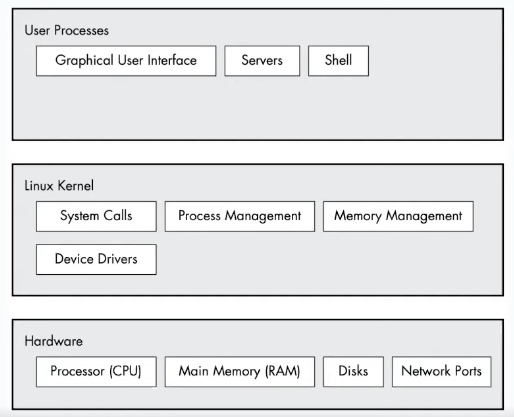
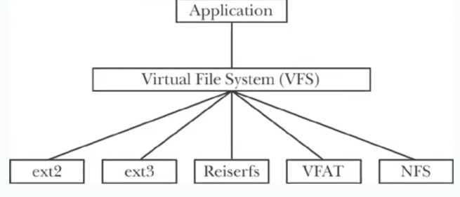

# 🦄 UNIX based OS

## OS

What is operation system?

* Kernel
* Shell
* Preinstalled apps (including system GUI)
* File System

## Kernel

What the kernel does

* manages processes (start, pause, stop, context switch)
* handles system calls
* manages memory
* works with hardware (via drivers)

### POSIX

POSIX stands for Portable Operating System Interface. It defines the application programming interfaces (APIs), along with command line shells and utility interfaces, for software compatibility with variants of Unix and other operating systems.

Compliance with POSIX is voluntary, and while many operating systems, including Linux, are mostly POSIX-compliant, systems such as macOS, AIX, HP-UX, and Solaris, are certified.

## File System

For Linux everything is file. Folder - file with list of inner files/folders.

## File modes and permissions

### **Authorization levels**

**Ownership**

* A **user** is the owner of the file. By default, the person who created a file becomes its owner. So, the user can sometimes be called an owner.
* A **group** contains several users. All of them have the same access permissions to the file. The group is useful when you have a project where a number of people require access to a file. Instead of manually assigning permissions to each user, you could add all the users to a group, and assign group permission to a file so that only the members of this group and no one else can read or modify the file.
* Any **other** user who has access to a file is the one who did not create this file and also does not belong to a group. Practically, it means everybody else. Hence, when you set the permissions for others, it is also referred to as set permissions for the world.

**Permission**

* **Read** **permission** gives users the authority to open and read a file. Read permission on a directory provides users with the list of its content.
* **Write permission** gives users the authority to modify the contents of a file. The write permission on a directory gives users the authority to add, remove, and rename files stored in the directory. Imagine you have a write permission on a file but do not have a write permission on the directory where the file is stored. You will be able to modify only the contents of the said file. However, you will not be able to rename, move, or remove the file from the directory.
* **Execute permission** lets users run a program. If the execute permission is not set, they might still be able to see/modify the program code (provided read and write permissions are set), but not run it.
* **No permission** means users can't do anything with a file.

**Table**

<table><thead><tr><th width="200.33333333333331">Number</th><th>Permission Type</th><th>Symbol</th></tr></thead><tbody><tr><td>0</td><td>No Permission</td><td>---</td></tr><tr><td>1</td><td>Execute</td><td>--x</td></tr><tr><td>2</td><td>Write</td><td>-w-</td></tr><tr><td>3</td><td>Execute + Write</td><td>-wx</td></tr><tr><td>4</td><td>Read</td><td>r--</td></tr><tr><td>5</td><td>Read + Execute</td><td>r-x</td></tr><tr><td>6</td><td>Read + Write</td><td>rw-</td></tr><tr><td>7</td><td>Read + Write + Execute</td><td>rwx</td></tr></tbody></table>

`-` - no permission\
`r` - read\
`w` - write\
`x` -  execute

Permission set `-rwxrw-r--`

the first **`-`** implies that we have selected a certain file. If it were a directory, `d` would have been used instead of the first `-`.

3 triplets of symbols. Each of them defines permissions for owner, group, and other users correspondingly. So, in the example, the owner can read, write and execute the file. The group can read and write, while the other can only read the file.

The most common sets presented as octal numbers are as follows:

* **755** is commonly used by web servers. The owner has all the permissions to read, write and execute it. Everyone else can read and execute but cannot make changes to the file.
* **644** means only the owner can read and write. Everyone else can only read. No one can execute this file.
* **655** means only the owner can read and write and cannot execute the file. Everyone else can read and execute and cannot modify the file.
* **777** means every user can read, write, and execute. Because it grants full permission, it should be used with caution. However, in some cases, you will need to set the 777 permissions before you can upload any file to the server.

|             | **File**                                | **Directory**                                                 |
| ----------- | --------------------------------------- | ------------------------------------------------------------- |
| **Read**    | One can open a file and see its content | One can view files in directories without opening these files |
| **Write**   | One can change the contents of the file | One can rename files                                          |
| **Execute** | One can run a file                      | One can have access to files                                  |

## Descriptor

A **descriptor** is a non-negative number assigned to a file or other IO resource.

* **Standard Input (stdin) - Descriptor 0:** is a channel where a program receives data for processing. In simple terms, stdin is like a "mailbox" where the program collects the incoming data it needs to work on. For example, when you type commands into a terminal, you're sending data through stdin to be processed by the system.
* **Standard Output (stdout) - Descriptor 1**: This is where the program sends data after processing it.
* **Standard Error (stderr) - Descriptor 2**: This stream is used for error messages and diagnostics.

## Threads

Threads in the context of Linux and operating systems in general are lightweight units of execution within a process that can operate independently. They are designed to enable concurrent execution of tasks, allowing for parallel processing and efficient resource utilization. Threads share the same memory space and resources with other threads in the process, which facilitates seamless data sharing and communication between threads.
The internal structure of a thread includes a stack, register set, and thread-specific data. This structure is crucial for its operation, as it allows threads to maintain their execution context independently of other threads within the same process.

## Process

In the Unix context, a process is an instance of a program in execution. When a command is issued in Unix/Linux, it creates or starts a new process. Each process in the system is assigned a unique 5-digit ID number known as the process ID (PID). This PID is used by Unix to track each process, ensuring that at any given time, no two processes have the same PID.

There are two main categories of processes in Unix:
- **User processes**: These are operated in user mode.
- **Kernel processes**: These are operated in kernel mode.

The lifetime of a process can be divided into several states, each with specific characteristics that describe the process. These states include:
- **Created**: The process is newly created by a system call and is not ready to run.
- **User running**: The process is running in user mode, which means it is a user process.
- **Kernel running**: The process is a kernel process running in kernel mode.
- **Preempted**: When a process runs from kernel to user mode, it is said to be preempted.
- **Ready to run in memory**: The process has reached a state where it is ready to run in memory and is waiting for the kernel to schedule it.
- **Ready to run, swapped**: The process is ready to run but no empty main memory is present.
- **Sleep, swapped**: The process has been swapped to secondary storage and is in a blocked state.
- **Asleep in memory**: The process is in memory (not swapped to secondary storage) but is in a blocked state.

Additionally, processes can be classified into different types, such as:
- **Parent and Child process**: Each user process has a parent process, with most commands having the shell as their parent.
- **Zombie process**: A process that has been killed but still shows its entry in the process status or the process table.
- **Orphan process**: A child process that becomes an orphan when its parent process is killed before the termination of the child process.
- **Daemon process**: System-related background processes that often run with root permissions and service requests from other processes.
