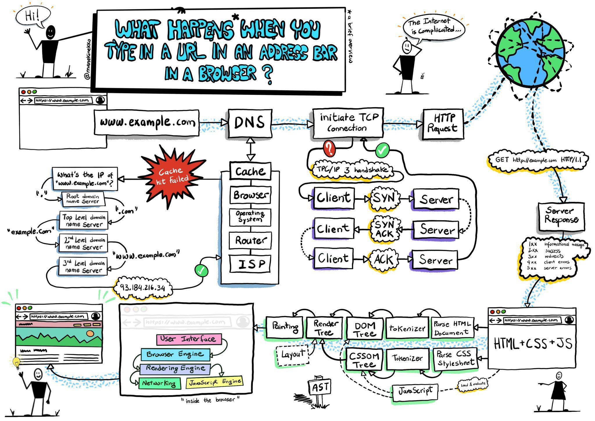
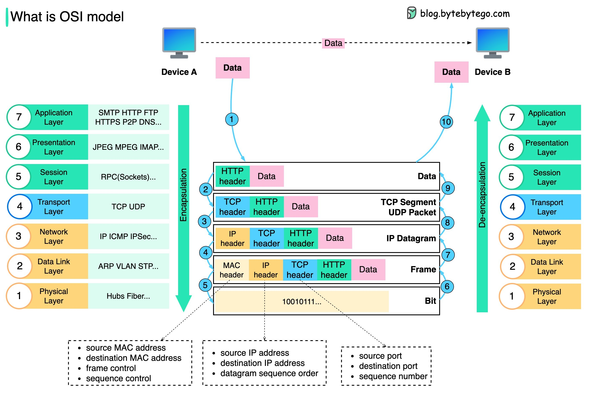
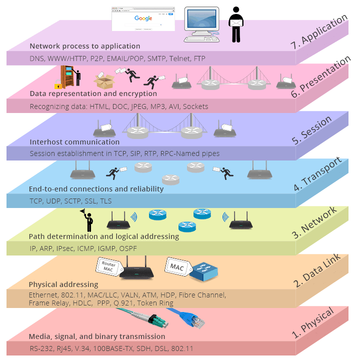
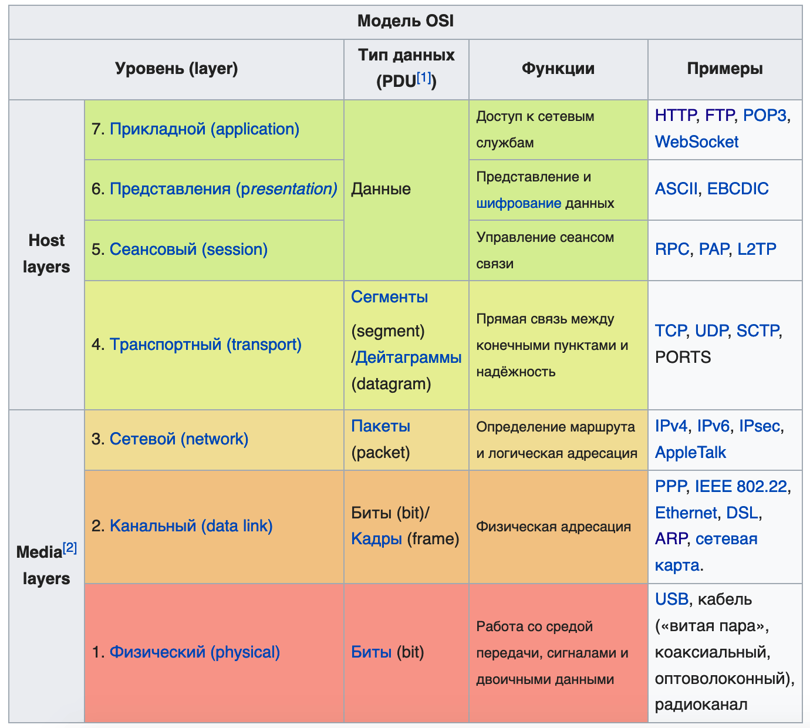
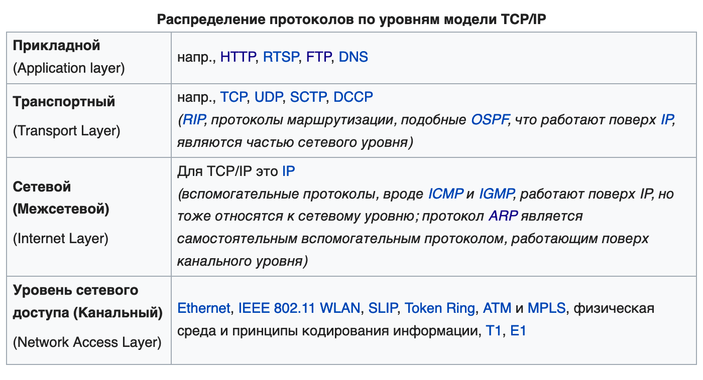
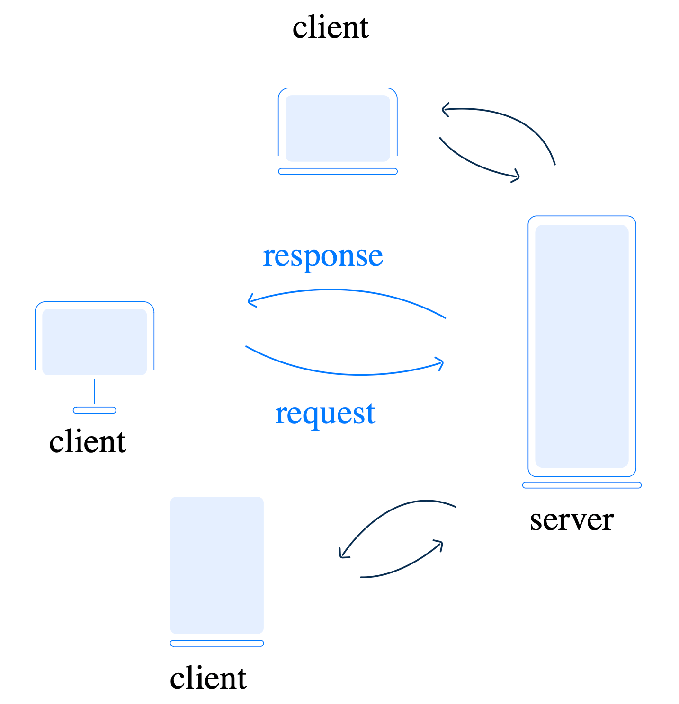
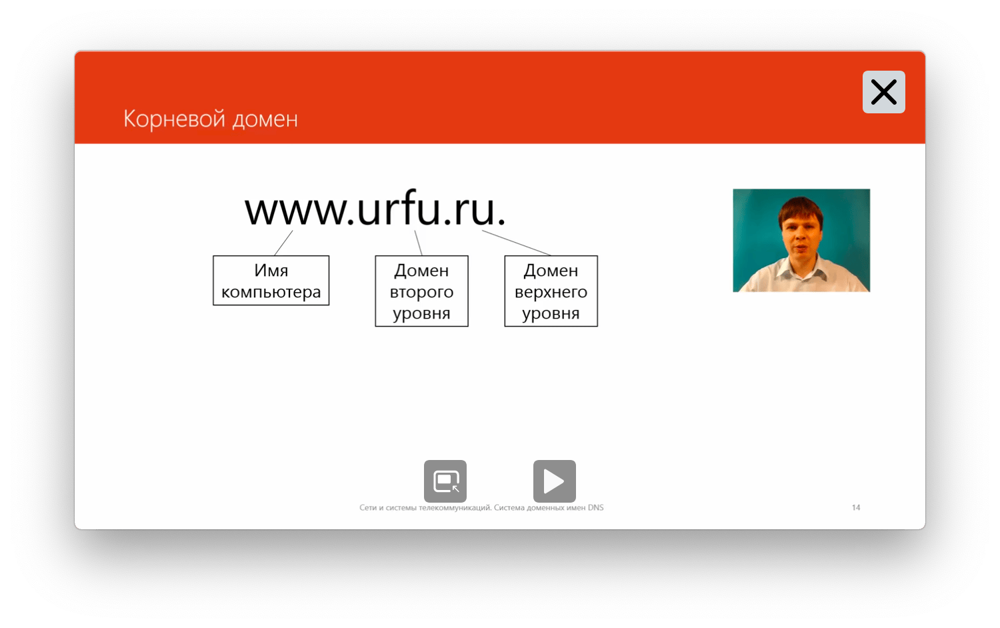
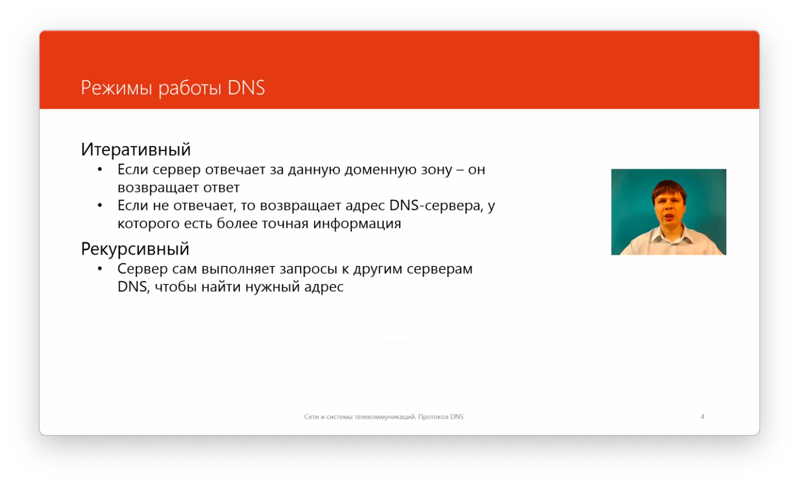
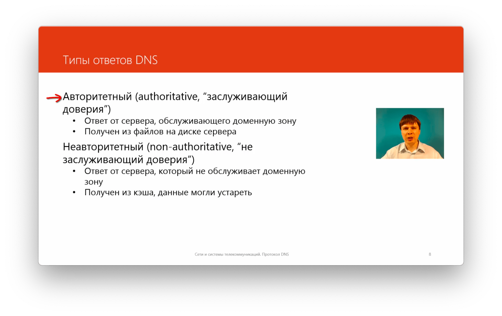
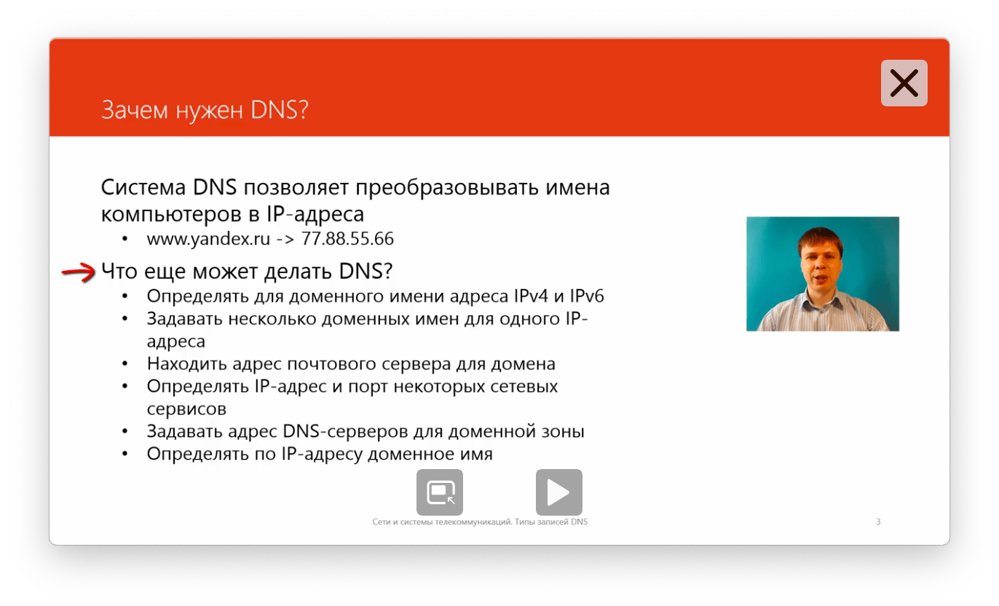

# Network

#### Links

- Lectures (ru) - [https://www.youtube.com/playlist?list=PLtPJ9lKvJ4oiNMvYbOzCmWy6cRzYAh9B1](https://www.youtube.com/playlist?list=PLtPJ9lKvJ4oiNMvYbOzCmWy6cRzYAh9B1)
- Web-App example (ru) - [https://www.youtube.com/watch?v=4haMUvUxUJI](https://www.youtube.com/watch?v=4haMUvUxUJI)

## Glossaries

### Термины

TLS - Transport Layer Security\
SSL - Secure Socket Layer\
TCP - Transmission Control Protocol\
UDP - User Datagram Protocol\
Hub - концентратор\
SSID - ServiceSetID - имя сети (WiFi)

### Стандарты

ISO международ орг. стандартизации\
IEEE - институт инженеров электротехнике и электронике\
IAB - совет по архитектуре интернета\
W3C - консорциум интернета

## IPv4 Subnet

Example - `"Subnet": "172.19.0.0/16", "Gateway": "172.19.0.1"`

IPv4 addresses are 4 blocks of 8 bits. For _172.19.0.0/16_ first 16 bits (2 sections) are constant and the rest is dynamic. 

_172.19.0-255.0-255_ - **Range** of IPs 
_172.19.0.0_ -  **Subnet Address**
_172.19.0.1_ - **Default Gateway**
_172.19.255.255_ - **Broadcast Address**. 

Devices will receive IPs in the range of _172.19.0.2-172.19.255.254._

## OSI Model

**OSI** stands for **Open Systems Interconnection**. The OSI model provides a visual representation of how each communication layer is built on top of another

### Layers

- Step 1: When Device A sends data to Device B over the network via the HTTP protocol, it is first added an HTTP header at the application layer.
- Step 2: Then a TCP or a UDP header is added to the data. It is encapsulated into TCP segments at the transport layer. The header contains the source port, destination port, and sequence number.
- Step 3: The segments are then encapsulated with an IP header at the network layer. The IP header contains the source/destination IP addresses.
- Step 4: The IP datagram is added a MAC header at the data link layer, with source/destination MAC addresses.
- Step 5: The encapsulated frames are sent to the physical layer and sent over the network in binary bits.
- Steps 6-10: When Device B receives the bits from the network, it performs the de-encapsulation process, which is a reverse processing of the encapsulation process. The headers are removed layer by layer, and eventually, Device B can read the data.
- We need layers in the network model because each layer focuses on its own responsibilities. Each layer can rely on the headers for processing instructions and does not need to know the meaning of the data from the last layer.

1. **Physical** — exchange of physical signals between physical devices using cables
2. **Data Link** — solves the problem of addressing when transmitting the information, establishes a connection between two physical devices
3. **Network** — provides package routing by discovering the best path across the network
4. **Transport** — responsible for data transport over the network built by the router on the previous layer
5. **Session** — manages the interaction between applications and opens up the possibility of task synchronization, session termination, and information exchange
6. **Presentation** — defines how data will be represented in the application. At this level, processes such as encoding, encryption, and decryption occur, according to the system requirements
7. **Application** — interactions with the end user occur through applications. At this layer, the transmitted data is presented, and user input and output take place.

## TCP/IP (Internet protocol suite)

#### links

- https://en.wikipedia.org/wiki/Internet_protocol_suite

Internet works based on the TCP/IP model

- Application Layer
	- BGP, DHCP (v6), DNS, FTP, HTTP (HTTP/3), HTTPS, IMAP, IRC, LDAP, MGCP, MQTT, NNTP, NTP, OSPF, POP, PTP, ONC/RPC, RTP, RTSP, RIP, SIP, SMTP, SNMP, SSH, Telnet, TLS/SSL
- Transport Layer
	- TCP, UDP, DCCP, SCTP, RSVP, QUIC
- Internet Layer
	- IPv4, IPv6, ICMP (v6), NDP, ECN, IGMP, IPsec
- Link Layer
	- ARP, Tunnels, PPP, MAC

### Application Layer
Прикладной уровень

#### HTTP

**HyperText Transfer Protocol**

[**https://developer.mozilla.org/en-US/docs/Web/HTTP**](https://developer.mozilla.org/en-US/docs/Web/HTTP)

HTTP keep-alive - постоянное соединение

HTTP pipelining - конвейерная обработка. Возможность отправить несколько запросов на получение нескольких ресурсов одновременно

HTTP позволяет браузеру и серверу договориться о кешировании полученных данных и правилах проверки актуальности и обновлений

#### SMTP/POP3/IMAP

#### DNS

Domain Name System

- Децентрализованная система
- пространство имен разделено на зоны (домены)
- за каждую зону отвечает регистратор

Default Protocol - UDP, Port - :53

#### DNS-over

- [adguard example](https://github.com/AdguardTeam/AdGuardHome/wiki/Configuration#configuring-upstreams)

DNS-over-HTTPS (DoH) - HTTPS over TCP (or HTTP/3 over QUIC) with TLS encryption on port 443.

DNS-over-TLS (DoT) - TLS over TCP on a dedicated port (853).

DNS over QUIC (DoQ) uses QUIC protocol directly as its transport layer, which is a UDP-based protocol that integrates TLS. Port - typicaly 784, 853.

##### apex domain

An apex domain, also known as a root domain or bare domain, is the highest level of a domain name. It is the domain name without any subdomains.  "example.com" is the apex domain.

##### types of DNS records

- A (Address) record: Maps a domain name to an IP address

`example.com → 192.0.2.1`
 
- AAAA (Quad A) record: Maps a domain name to an IPv6 address
 
`example.com → 2001:db8::1`
 
- CNAME (Canonicalexample.com → 192.0.2.1 Name) record: Maps an alias or subdomain to the canonical name of a server or another domain
  
- MX (Mail Exchanger) record: Directs email to a mail server
- NS (Name Server) record: Specifies the name servers for a domain
- PTR (Pointer) record: Maps an IP address to a domain name (reverse DNS)

`192.0.2.1 → example.com`
  
- SOA (Start of Authority) record: Specifies the name server that is authoritative for a domain
- SPF (Sender Policy Framework) record: Specifies which mail servers are authorized to send email on behalf of a domain
- SRV (Service) record: Specifies the location of a service, such as a VoIP server
- TXT (Text) record: Stores arbitrary text data, often used for verification or authentication purposes

Режим работы DNS

Типы ответов

Возможности DNS

### Transport Layer

#### UDP - User Datagram Protocol

Нет надежной доставки\
Нет сохранения порядка сообщений

DNS использует UDP (преимущественно)

Нет проверки получения запросов, при отправке запроса запускается таймер и повторяет запрос если на него не получен ожидаемый ответ

Основная задача - укзать порты отправителя и получателя

#### TCP - Transmission Control Protocol

Гарантия доставки данных (подтверждение получения сегментов данных)\
Гарантия порядка сообщений

Перед передачей данных устанавливается соединение (three-way handshake) в рамках которого устанавливаются параметры передачи данных

##### TCP three-way handshake

protocol that ensures that both the client and the server are ready to communicate before any data is exchanged

1. The client sends a SYN (synchronize) packet to the server, indicating that it wants to establish a connection. The SYN packet includes a sequence number, which is a random value that the client uses to initialize the sequence number for the connection.
2. The server receives the SYN packet and sends a SYN-ACK (synchronize-acknowledge) packet back to the client. The SYN-ACK packet includes an acknowledgment number, which is the client's sequence number plus one, and a sequence number, which is a random value that the server uses to initialize the sequence number for the connection.
3. The client receives the SYN-ACK packet and sends an ACK (acknowledge) packet back to the server. The ACK packet includes an acknowledgment number, which is the server's sequence number plus one.

#### Ports

1-1024

- :80 - HTTP (WEB)
- :443 - HTTPS (WEB)
- :25 - SMTP (MAIL)
- :53 - DNS
- :20 - FTP (data) 
- :21 - FTP (control) 
- :22 - SSH 
- :23 - Telnet 
- :25 - SMTP 
- :53 - DNS 
- :80 - HTTP
- :110 - POP
- :143 - IMAP
- :179 - BGP
- :389 - LDAP
- :465 - SMTP (secure)
- :546 - DHCPv6 (client) 
- :547 - DHCPv6 (server)
- :636 - LDAP (secure)
- :993 - IMAP (secure)
 
1025-49151 - Registered ports (cannot be used)

49151-65535 - Dynamic ports (can be used)

#### Сокеты

Сокет - сочетание IP + TCP(port)\
Определяется как на стороне клиента, так и на стороне сервера

#### NAT

**Network Address Translation**

Механизм в сетях TCP/IP, позволяющий изменять IP-адрес в заголовке пакета, проходящего через устройство маршрутизации трафика.

#### Firewall

Брандмаур/Межсетевой экран

Позволяет фильтровать все проходящие запросы по заданным правилам фильтрации

### Network Layer

#### IPv6

**GUA** - Global Unicast Address. Routable on the public internet

example `2001:0db8:1234:5678:90ab:cdef:1234:5678`

- `2001:0db8:1234`: GUA prefix, which is 48 bits long.
	- `2001`:  first 16 bits of the prefix, which is known as the "global routing prefix".
	- `0db8`: "registry ID"
	- `1234`: "organization ID"
- `5678`: subnet ID, which is 16 bits long.
- `90ab:cdef`: interface ID, which is 64 bits long.
- `1234:5678`: host ID, which is 64 bits long.

**ULA** - Unique local address. Private IPv6 address

example `fc00:1234:5678:9abc:def0:1234:5678:9abc`

- `fc00` : ULA prefix
- `1234:5678:9abc` : Global ID (randomly generated)
- `def0` : Subnet ID
- `1234:5678:9abc` : Interface ID

**Link-local address** - only for communication within the local network segment.

- Created automatically by devices on a network using the Stateless Address Auto configuration (SLAAC) protocol.
- Can be configured using the EUI-64 method (where the MAC address is embedded into the IPv6 address).

example `fe80:0000:0000:0000:0211:22ff:fe33:4455`

- `fe80::/64` : Link-local prefix
- `0000:0000:0000:0000`: interface ID, which is 64 bits long
- `0211:22ff:fe33:4455`: host ID, which is 64 bits long

**RA** - Route Advertisement

When enabled, router will periodically send **RA messages** or respond to **Router Solicitation (RS) messages** from clients. Contain information, such as:

- The **IPv6 prefix** used on the network (e.g., `2001:db8::/64`).
- Whether clients should use **SLAAC** Stateless Address Autoconfiguration
- Whether clients should use **DHCPv6** for additional configuration
- The **default gateway** IPv6 address.

**SLAAC** - Stateless Address Autoconfiguration

### Link Layer

tbd