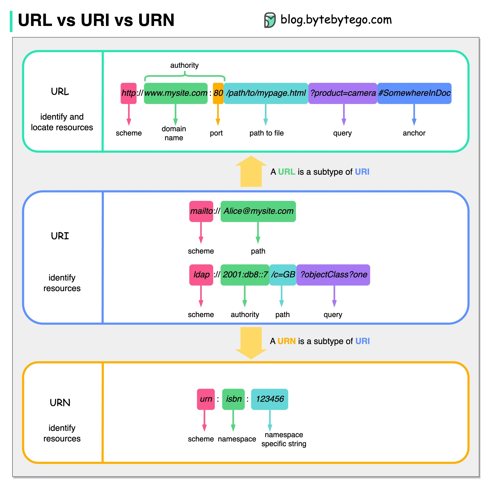

# URL

URL address has a certain structure based on the following template:

```
<protocol>://<login>:<password>@<host>:<port>/<path>?<request parameters>#<anchor>
```

Now let's look at this template in more detail:

* `<protocol>` is a way of exchanging data with a resource. You are probably most familiar with HTTP and HTTPS protocols, but there are others;
* `<login>` and `<password>` are prefixes that transmit authentication data for some protocols, if necessary;
* `<host>` is the domain name or IP address where the site is located. **Domain** is the name of the site, its address in the global network;
* `<port>` is required for connection within the specified host. The official port for HTTP connections is 80, and the alternative is 8080, but it is possible to use any other ports too. The default setting for HTTPS is 443;
* `<path>` indicates the exact address of a particular file or page;
* `<request parameters>` are parameters transmitted to the server. Depending on request parameters, the site may slightly change its display. For example, it is possible to sort the items of a list in a different order;
* `<anchor>` allows you to connect to a specific part of a web page or document.

## URL, URI, URN


