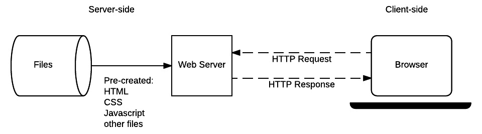
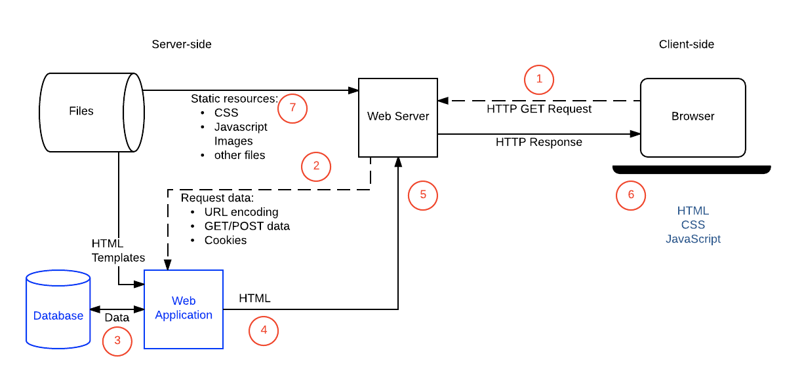

# Static/Dynamic sites

Web browsers communicate with [web servers](https://developer.mozilla.org/en-US/docs/Learn/Common\_questions/What\_is\_a\_web\_server) using the HyperTextTransfer Protocol ([HTTP](https://developer.mozilla.org/en-US/docs/Web/HTTP)).

## Static sites 

A _static site_ is one that returns the same hard coded content from the server whenever a particular resource is requested

## Dynamic sites

A _dynamic site_ is one that can generate and return content based on the specific request URL and data (rather than always returning the same hard-coded file for a particular URL).

A _Web Application's_ job is to receive HTTP requests and return HTTP responses. While interacting with a database to get or update information are very common tasks, the code may do other things at the same time, or not interact with a database at all.

links:

- https://developer.mozilla.org/en-US/docs/Learn/Server-side/First_steps/Client-Server_overview

### SSR Server-Side Rendering

- HTML is generated on the server on each request
- Server sends a fully rendered HTML page to the browser
- Browser shows content immediately, then JS enhances interactivity

### CSR Client-Side Rendering

- Server sends a blank HTML page + JavaScript bundle
- Browser runs JS, which builds and renders the UI on the client side
- Data fetched via API, then rendered in-browser
