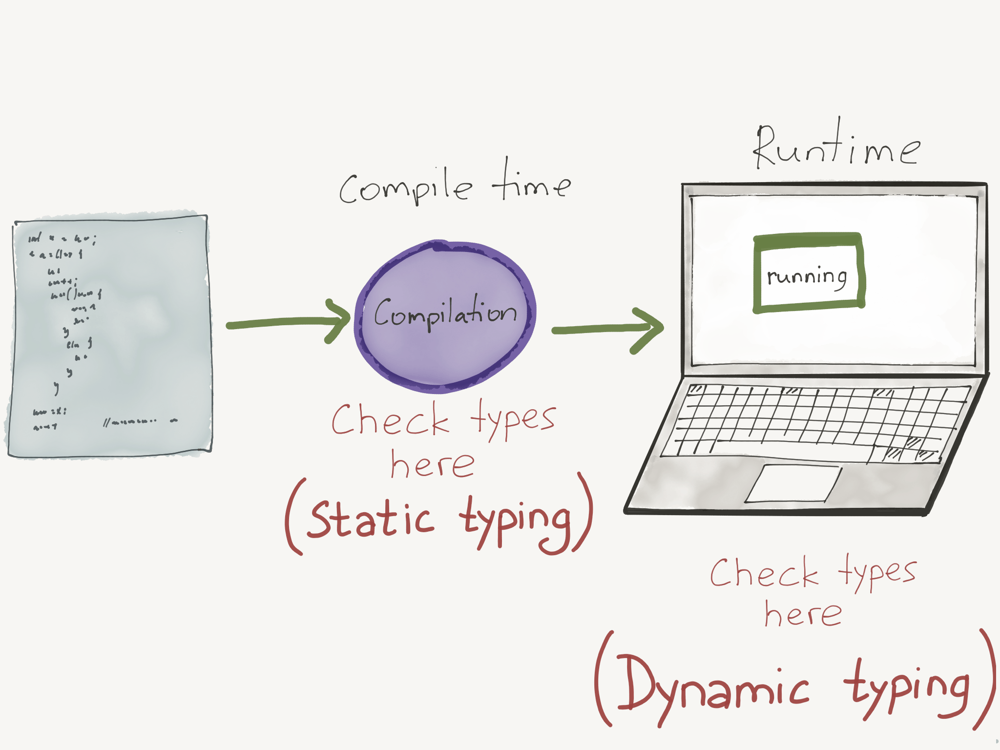
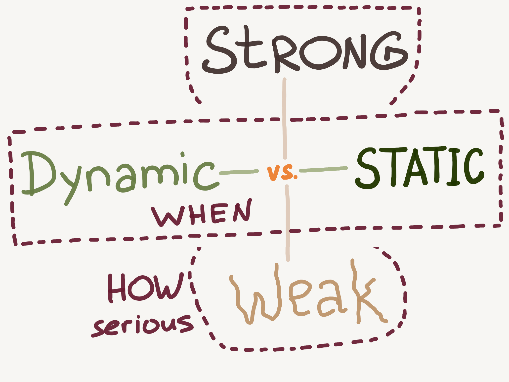
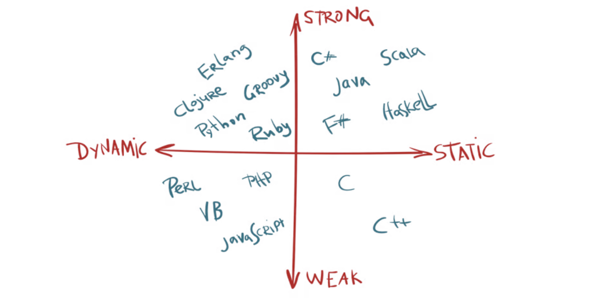
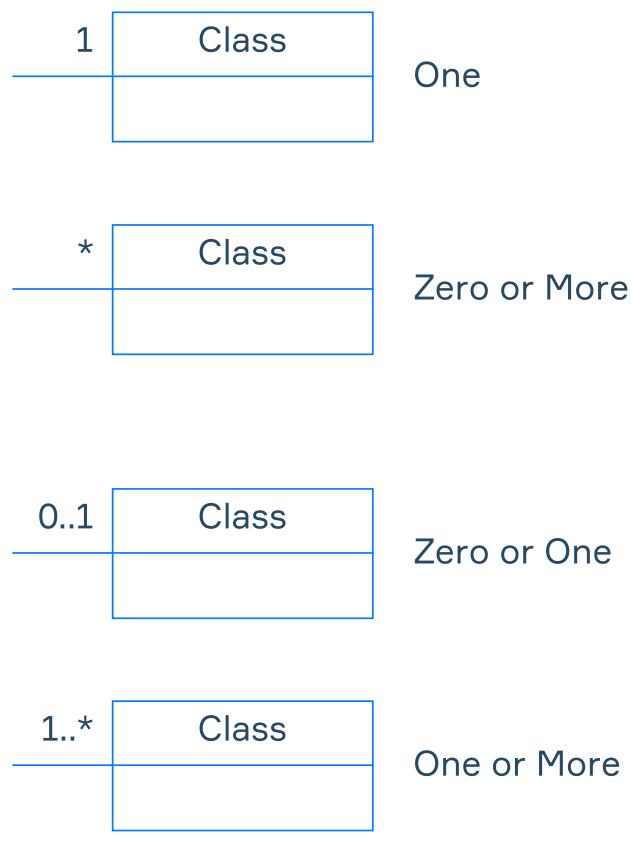

# 🤓 Basic Knowledge

#### Links

- hexlet.io/courses/intro_to_programming/lessons/types/theory_unit
- educative.io/answers/statically-v-dynamically-v-strongly-v-weakly-typed-languages

## Typing

Statically vs dynamically vs strongly vs weakly typed languages

### Type checking



- Static type-checking - checking types during compilation process
- Dynamic type-checking - checking types at run time

### Strong and weak typing



Strong versus weak is about HOW SERIOUS DO YOU GET while checking the types.

JS example: weak typing

```javascript
4 + '7';      // '47'
4 * '7';      // 28
2 + true;     // 3
false - 3;    // -3
```

Python example: strong typing

```python
var = 21;            #type assigned as int at runtime.
var = var + "dot";   #type-error, string and int cannot be concatenated.
print(var);
```



## Design principles

- Don't Repeat Yourself (**DRY**)
- You Ain't Gonna Need It (**YAGNI**)
- Keep It Simple, Stupid (**KISS**)

### SOLID

[Single responsibility principle](https://en.wikipedia.org/wiki/Single\_responsibility\_principle)\
A [class](https://en.wikipedia.org/wiki/Class\_\(computer\_programming\)) should only have a single responsibility, that is, only changes to one part of the software's specification should be able to affect the specification of the class.

[Open–closed principle](https://en.wikipedia.org/wiki/Open%E2%80%93closed\_principle)\
"Software entities ... should be open for extension, but closed for modification."

[Liskov substitution principle](https://en.wikipedia.org/wiki/Liskov\_substitution\_principle)\
"Objects in a program should be replaceable with instances of their subtypes without altering the correctness of that program." See also [design by contract](https://en.wikipedia.org/wiki/Design\_by\_contract).

[Interface segregation principle](https://en.wikipedia.org/wiki/Interface\_segregation\_principle)\
"Many client-specific interfaces are better than one general-purpose interface."

[Dependency inversion principle](https://en.wikipedia.org/wiki/Dependency\_inversion\_principle)\
One should "depend upon abstractions, \[not] concretions."

## OOP

Object-Oriented Paradigm

### Class Diagram

In the Unified Model Language (UML), Class Diagram is a visual representation of an object-oriented structure

#### Elements

- Classes
- Class attributes
- Class methods
- Class relationships

#### Visibility options

Each element of a class has a visibility option

- `+` (Public) – element can be accessed by any class in the system;
- `-` (Private) – element can be accessed only by a class that owns it;
- `#` (Protected) – element can be accessed by classes that have a generalisation (or inheritance) relationship with its class;
- `~` (Package) – element can be accessed by classes that are located in the same package.

## Class relationships

- Generalization (inheritance) - one class could be described as a child class which assumes and could use methods of a parent class
- Dependency – change in one class can affect another class
- Realization – the relationship between the blueprint class and the object containing its respective implementation level details
- Association - instances of one class are connected to instances of another
	- Aggregation - one class as a part of the other
	- Composition - classes share lifespan

#### Association relationships

Type of relationship, indicates that instances of one class are connected to instances of another.



## Number Systems

### Binary (base 2)

binary digit - bit

Uses two digits: 0 and 1.

### Octal (base-8)

Uses eight digits: 0 to 7.

### Decimal (base-10)

Uses ten digits: 0 to 9.

### Hexadecimal (base-16)

Hexadecimal Number System

Uses sixteen digits: 0 to 9 and A to F (where A=10, B=11, C=12, D=13, E=14, F=15).

`63h`, `0x63` -  different ways to indicate that 63 is a hexadecimal number.

Allows to read and write binary data more easily

- 1 hex digit = 4 bits (a nibble)
- 2 hex digits = 8 bits = 1 byte

```shell
# to decimal
echo $((16#f))
>> 15

echo $((16#ff))
>> 255

echo $((16#ffff))
>> 65535
```

## Bits and Bytes

- 1 byte = 8 bits (binary digits)
- 1 byte can represent values from 
	- 0 to 255 (in decimal)
	- 00 to FF (in hexadecimal)

## Base-64

Uses 64 characters, typically including A-Z, a-z, 0-9, and two additional symbols (often + and /).

## Primitive Data Structures

- **Integers**: Whole numbers
- **Floats**: Decimal numbers
- **Characters**: Single letters or symbols
- **Booleans**: True or false values

## Non-Primitive Data Structures

### Arrays

A collection of elements of the same type, stored in contiguous memory locations. Each element can be accessed using its index.

- O(1) time complexity for accessing elements by index, making it very fast for retrieval.
- O(n) time complexity for insertion and deletion (except at the end) because elements may need to be shifted to maintain order.

### Linked lists

A linear collection of nodes, where each node contains data and a reference (link) to the next node. It allows for dynamic memory allocation.

First node - HEAD, Last node - TAIL

- O(n) time complexity for accessing elements, as you must traverse the list from the head to reach a specific node.

### Stacks

### Queues

### Trees

### Graphs

## Character Encoding

[article](https://www.joelonsoftware.com/2003/10/08/the-absolute-minimum-every-software-developer-absolutely-positively-must-know-about-unicode-and-character-sets-no-excuses/)

There are different characters. Like ! or ? or even 😀. To store and show it to user we need to encode it, because in memory it will be in any case as binary number. So we need standard that explained how to work with that.

### ASCII Standart

American Standard Code for Information Interchange  

[link](http://www.robelle.com/library/smugbook/ascii.html)

ASCII character set defines 128 characters (0 to 127 decimal, 0 to 7F hexadecimal, and 0 to 177 octal). First 32 values are non-printing **control characters**, such as _Return_ and _Line feed_. Rest - Printing Characters.

Each character takes 7bit (128 variations), there are also many options of Extended ASCII which uses 8bit and having 128 standard + 128 specific symbols.

### Unicode Standart

[link](https://home.unicode.org/)

- common variations UTF-8, UTF-16, UTF-32
	- In UTF-8, every code point from 0-127 is stored _in a single byte_. Only code points 128 and above are stored using 2, 3, in fact, up to 6 bytes.
	- UTF-32 - any character is 4 bites, 32bits

Unicode uses `code point` to present each character. U-0041 is `A`. Format - `U-'hexadecimal_number'`

### examples

```shell
# convert text to a bytecode format
echo -n "Hello World" | xxd -p
>> 48 65 6c 6c 6f 20 57 6f 72 6c 64 # 11bytes

echo -n "48656c6c6f20576f726c64" | xxd -r -p # reverse
>> Hello World%

# convert to binary format
echo -n "Hello World" | xxd -b
>> 00000000: 01001000 01100101 01101100 01101100 01101111 00100000  Hello
>> 00000006: 01010111 01101111 01110010 01101100 01100100           World

# print unicode symbols
printf '\u0048\u0065\u006C\u006C\u006F\u0020\u0057\u006F\u0072\u006C\u0064\n'
>> Hello World

echo '\u3064'
>> つ

printf '\U1F471\n'
>> 👱

# decode code point to bytecode
echo -n "\U1F471" | xxd -p
>> f09f91b1 # f0 9f 91 b1 takes 4 bytes

# decode charecter to bytecode
echo -n "👱" | xxd -p
>> f09f91b1 # f0 9f 91 b1 takes 4 bytes

echo -n "1" | xxd -p
>> 31 # 0x31 takes 1 byte
```

### Character list

| !   | Exclamation mark                   |
| --- | ---------------------------------- |
| "   | Quotation mark (`&quot;` in HTML)  |
| #   | Cross hatch (number sign)          |
| $   | Dollar sign                        |
| %   | Percent sign                       |
| &   | Ampersand                          |
| `   | Closing single quote (apostrophe)  |
| (   | Opening parentheses                |
| )   | Closing parentheses                |
| *   | Asterisk (star, multiply)          |
| +   | Plus                               |
| ,   | Comma                              |
| -   | Hyphen, dash, minus                |
| .   | Period                             |
| /   | Slant (forward slash, divide)      |
| 0   | Zero                               |
| 1   | One                                |
| 2   | Two                                |
| 3   | Three                              |
| 4   | Four                               |
| 5   | Five                               |
| 6   | Six                                |
| 7   | Seven                              |
| 8   | Eight                              |
| 9   | Nine                               |
| :   | Colon                              |
| ;   | Semicolon                          |
| <   | Less than sign (`&lt;` in HTML)    |
| =   | Equals sign                        |
| >   | Greater than sign (`&gt;` in HTML) |
| ?   | Question mark                      |
| @   | At-sign                            |
| [   | Opening square bracket             |
| \   | Reverse slant (Backslash)          |
| ]   | Closing square bracket             |
| ^   | Caret (Circumflex)                 |
| _   | Underscore                         |
| `   | Opening single quote               |
| {   | Opening curly brace                |
| \|  | Vertical line                      |
| }   | Cloing curly brace                 |
| ~   | Tilde (approximate)                |